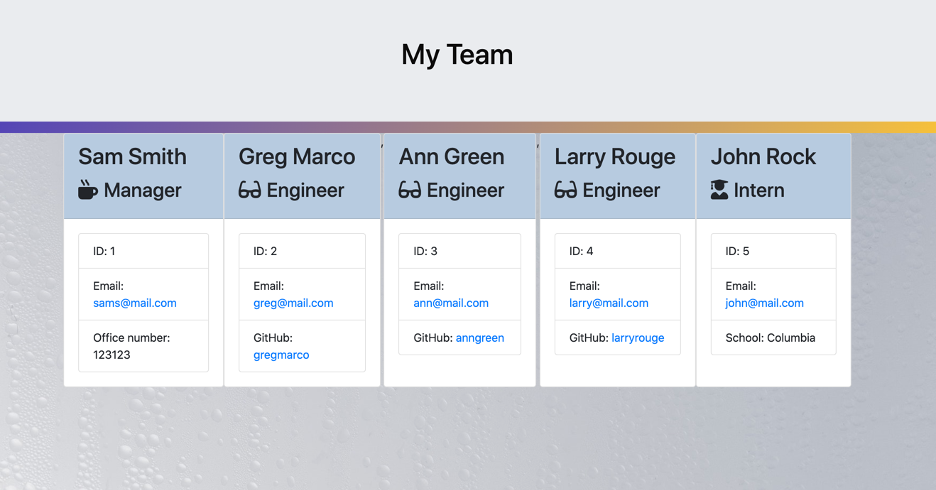

# Unit 10 OOP Homework: Template Engine - Employee Summary

[](https://img.shields.io/badge/Project%20title-Template%20Engine-green)

## User story:
```
As a manager
I want to generate a webpage that displays my team's basic info
so that I have quick access to emails and GitHub profiles
```
## Description


This app (software engineering team generator command line application) is built with `Node CLI` that takes in information about employees and generates an HTML webpage that displays summaries for each person. 
* Using JEST testing 
* Using OOP
* Using validation to ensure that the information provided is in the proper expected format (`Full name` should be camel case / first and last name should be separated with '_', `ID` should be a number, `email` should contain '@').

The application prompts the user for information about the team manager and then information about the team members. The user can input any number of team members, and they may be a mix of engineers and interns. When the user has completed building the team, the application will create an HTML file that displays a nicely formatted team roster based on the information provided by the user. 

## Installation 

npm installation

## Author

🎗 Tatyana Khan

The directory structure looks like this:

```
lib/           // classes and helper code
output/        // rendered output
templates/     // HTML template(s)
test/          // jest tests
  Employee.test.js
  Engineer.test.js
  Intern.test.js
  Manager.test.js
app.js         // Runs the application
```
### Classes
The project includes the three classes: `Employee`, `Manager`, `Engineer`,
`Intern`. For each class there is particular test in the `tests` directory, all of them passed.

The first class is an `Employee` parent class with the following properties and
methods:

  * name
  * id
  * email
  * getName()
  * getId()
  * getEmail()
  * getRole() // Returns 'Employee'

The other three classes will extend `Employee`. 

In addition to `Employee`'s properties and consecutive methods, `Manager` will also have:

  * officeNumber

In addition to `Employee`'s properties and consecutive methods, `Engineer` will also have:

  * github  // GitHub username

In addition to `Employee`'s properties and consecutive methods, `Intern` will also have:

  * school 


### Roster output

The project must generate a `team.html` page in the `output` directory, that displays a nicely formatted team roster. Each team member should display the following in no particular order:

  * Name

  * Role

  * ID

  * Role-specific property (School, link to GitHub profile, or office number)
  